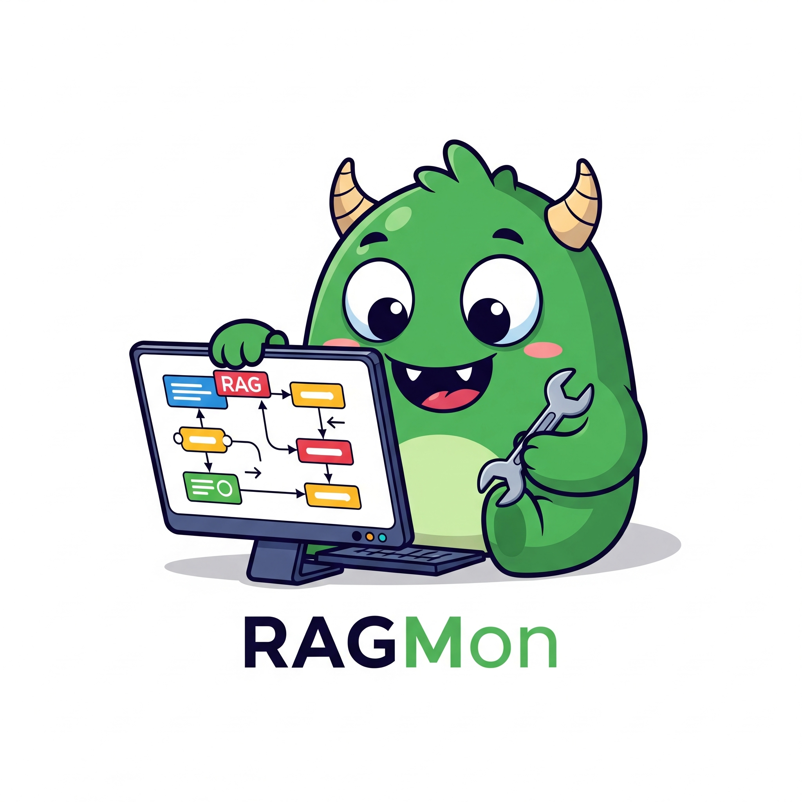
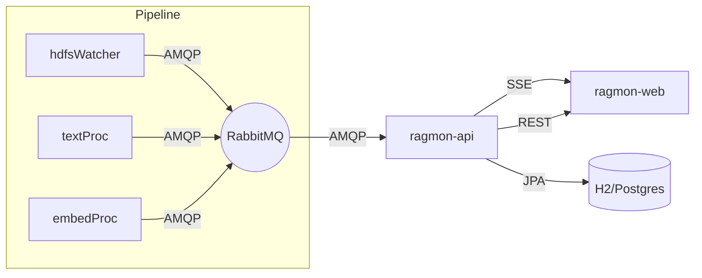

<div align="center">

  

  <h2>RAGMon</h2>
  <p>Realtime RAG pipeline monitoring & control</p>

  <p>
    <a href="#quick-start">Quick Start</a> •
    <a href="#features">Features</a> •
    <a href="#architecture">Architecture</a> •
    <a href="#ui-preview">UI Preview</a> •
    <a href="#configuration">Configuration</a> •
    <a href="#api--stream">API & Stream</a>
  </p>

</div>

### Highlights

- ✅ Colorful, live dashboard with SSE streaming
- 🐇 RabbitMQ-driven monitoring for `hdfsWatcher`, `textProc`, `embedProc`
- 🧭 Auto-discovery of app URLs from INIT messages
- 🧩 Controls: proxy-based actions (start/stop/toggle, file ops)
- 🔐 Basic Auth (dev-friendly), single-port deployment for Cloud Foundry
- 🧹 Self-healing instance registry with auto-pruning (120s)

## Quick Start

1) Dev prerequisites
- Docker (for RabbitMQ via `hdfswatcher-rabbit`)
- Node 18+/pnpm or npm, Java 21, Maven Wrapper

2) Run dev
```bash
./scripts/dev-run.sh
```
- API: `http://localhost:8080` (serves UI & API on one port)
- UI dev proxy (when running web alone): 5173 → 8080

3) Health
- Swagger UI: `/swagger-ui.html`
- Stream: `/stream` (SSE)
- Instances: `/api/instances` and `/api/instances/stream`

## Features

- Live Stream table with heartbeats and graceful reconnect
- Instances page with service grouping and liveness pills (Running/Processing/Error/Offline)
- App cards with controls (Health/Info/Metrics, Start/Stop/Toggle, Upload/Refresh/Batch)
- URL discovery from first INIT/HEARTBEAT; proxy routes: `/api/proxy/{app}/**`
- Presence model: any message counts as activity; explicit heartbeats also tracked

## Architecture



### Instance Registry
- Key: (`service`, `instanceId`), optional `bootEpoch`, `version`, `url`
- Alive if activity in ≤ 30s; pruned if inactivity > 120s
- Endpoints: `GET /api/instances`, `SSE /api/instances/stream`

## UI Preview

Screens include:
- Dashboard (KPIs + Recent Events)
- Live Stream
- Apps (cards + controls)
- Instances (grouped, colorful status)
- Settings

## Configuration

Environment (dev defaults provided):
- `RAGMON_RABBIT_HOST`, `RAGMON_RABBIT_PORT`, `RAGMON_RABBIT_VHOST`, `RAGMON_RABBIT_USER`, `RAGMON_RABBIT_PASS`
- `RAGMON_BASIC_USER`, `RAGMON_BASIC_PASS`
- `RAGMON_DB_URL`, `RAGMON_DB_USER`, `RAGMON_DB_PASS`

Spring profile `dev` is implied in `scripts/dev-run.sh` and uses Docker container `hdfswatcher-rabbit`.

## API & Stream

Key endpoints:
- REST: `/api/apps`, `/api/queues`, `/api/metrics`, `/api/events/recent`, `/api/instances`
- Stream: `/stream` (SSE with server heartbeat every 5s)
- Proxy: `/api/proxy/{app}/**` → forwards to discovered app URL

Event schema highlights (from apps):
- `instanceId`, `timestamp`, `event: INIT|HEARTBEAT|FILE_PROCESSED`
- `status: PROCESSING|DISABLED|IDLE|ERROR`
- `hostname`, `publicHostname` (include port)
- `currentFile`, `filesProcessed/Total`, `totalChunks/processedChunks`, `processingRate`, `errorCount`
- `meta.service` required; `meta.*` flexible

## Contributing

- Build everything: `./mvnw -DskipTests -pl ragmon-api -am package`
- Run dev (UI + API + RabbitMQ lifecycle): `./scripts/dev-run.sh`

## License

Apache-2.0 (pending owner confirmation)


