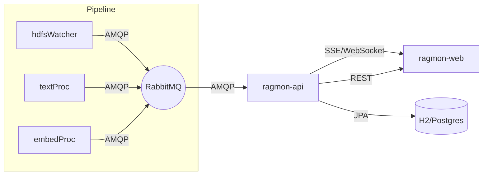

# RAGMon – Consolidated Guide

A single, skimmable guide combining the core docs. For a phased roadmap, see `development_plan.md`.

## Conceptual Overview

The system monitors a multi-app RAG pipeline and exposes a real-time, human-friendly view with optional controls.

Key behaviors
- Streaming-first UX: UI listens to a continuous stream; REST fills charts/metrics.
- Backpressure & resiliency: client can pause, buffer, and resume; server applies retention windows.
- Discoverability: app URLs discovered from first messages and shown in UI.

## Implementation Details

### Backend (ragmon-api)
- Java 21, Spring Boot 3.5.4 (parent POM) with Maven Wrapper
- Starters: WebFlux, AMQP, Actuator, Validation, Security (Basic), JPA
- Transport: default SSE (WebFlux), optional WebSocket (config via `ragmon.stream.transport`)
- Persistence: rolling event history via H2 (dev) / Postgres (prod) with retention
- OpenAPI via springdoc (`/swagger-ui.html`)

Configuration (env → properties)
- `RAGMON_RABBIT_HOST`, `RAGMON_RABBIT_PORT`, `RAGMON_RABBIT_VHOST`, `RAGMON_RABBIT_USER`, `RAGMON_RABBIT_PASS`
- `RAGMON_BASIC_USER`, `RAGMON_BASIC_PASS`
- `RAGMON_DB_URL`, `RAGMON_DB_USER`, `RAGMON_DB_PASS`

Instance Presence & Pruning
- Identity: (`service`, `instanceId`) with optional `bootEpoch`, `version`, and `url`.
- Liveness: Alive if any activity within 30s; prune if no activity/heartbeat > 120s.
- API/SSE: `GET /api/instances` and `SSE /api/instances/stream` (prunes on tick).

### Frontend (ragmon-web)
- Vite + React + TypeScript + Tailwind + shadcn/ui + TanStack Query + ECharts
- State/data: Query for REST, a shared hook for SSE/WebSocket
- Components: KPI cards, charts, virtualized live table, controls (segmented buttons, toggles, modals)

### Controls
- Start/Stop/Scale exposed when service advertises capability
- Confirmations for destructive actions
- Proxy path: `/api/proxy/{app}/**` to reach discovered service URLs

## Quick Reference

Commands
- Build backend+web: `./mvnw -DskipTests -pl ragmon-api -am package`
- Run dev (API + UI + RabbitMQ lifecycle): `./scripts/dev-run.sh`

Ports
- API and UI served on single port: 8080 (or `$PORT` on Cloud Foundry)
- UI dev server: 5173 (proxies to 8080)

Endpoints
- REST: `/api/apps`, `/api/queues`, `/api/metrics`, `/api/events/recent`, `/api/instances`
- Stream: `/stream` (SSE, 5s heartbeat)
- Proxy: `/api/proxy/{app}/**`

Event Schema Highlights
- `instanceId`, `timestamp`, `event: INIT|HEARTBEAT|FILE_PROCESSED`
- `status: PROCESSING|DISABLED|IDLE|ERROR`
- `hostname`, `publicHostname` (include port)
- `currentFile`, `filesProcessed/Total`, `totalChunks/processedChunks`, `processingRate`, `errorCount`
- `meta.service` required; `meta.*` flexible

## Gotchas & Mitigations

- High event volume can starve UI rendering
  - Use windowed rendering, virtualization, and throttled re-renders
- Broker disconnects cause gaps
  - Exponential backoff reconnect, banner indicating degraded mode
- Unknown/evolving message schemas
  - Tolerant DTOs; add contract tests; feature-flag new fields
- Restarted instances may appear as duplicates if identifiers change
  - Pruning removes entries with inactivity >120s; prefer stable `instanceId` and include `bootEpoch`

## Development Plan

For detailed phased tasks and status, see `development_plan.md`.
