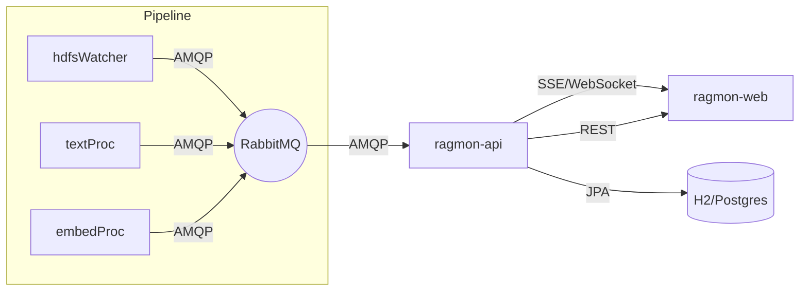

# Mental Model

The system monitors a multi-app RAG pipeline and exposes a real-time, human-friendly view with optional controls.

- Event Source: existing apps (`hdfsWatcher`, `textProc`, `embedProc`) publish messages to RabbitMQ.
- Bridge/API: a Spring Boot service consumes those messages, normalizes them, persists recent history, and exposes:
  - Streaming endpoint (SSE/WebSocket) for live updates
  - REST endpoints for metrics, recent events, queues, app health
  - Optional control endpoints (start/stop/scale) if available
- UI: a React SPA renders dashboards, live streams, queues/apps views, and control surfaces.

Key behaviors
- Streaming-first UX: UI listens to a continuous stream; REST fills charts/metrics.
- Backpressure & resiliency: client can pause, buffer, and resume; server applies retention windows.
- Discoverability: app URLs discovered from their first messages and shown in UI.
